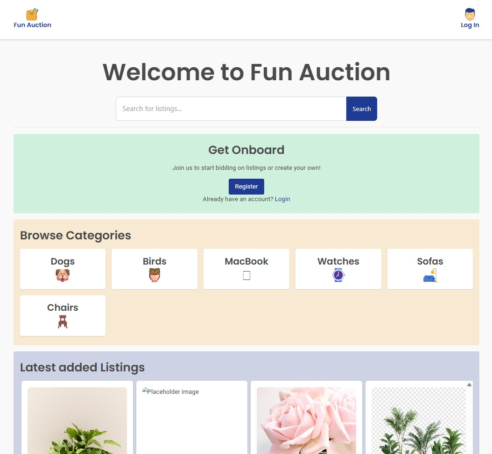

# Fun Auction



An auction platform built for the Noroff Semester Project 2. Users can list items, bid on listings, and manage their credits in a responsive single-page experience.

## Description

Fun Auction provides a full auction workflow tailored for students at the Noroff School of Technology and Digital Media. The application includes secure authentication, personal profile management, and real-time listing updates through the Noroff Auction API.

Key highlights:

- Register with a `stud.noroff.no` email address and receive 1000 starter credits.
- Browse, search, and filter listings without creating an account.
- Create rich listings with images, descriptions, and closing dates.
- Place bids on active listings and view the complete bidding history.
- Track credits earned from sales and spent on purchases.
- Update profile avatars and review personal activity.

## Built With

- HTML5
- CSS3 ([Tailwind CSS](https://tailwindcss.com/))
- JavaScript (ES6)
- [Vite](https://vitejs.dev/)
- [Jest](https://jestjs.io/) and [Cypress](https://www.cypress.io/)
- [GitHub Actions](https://github.com/features/actions) for CI/CD

## Getting Started

### Installing

Clone the repository and install dependencies:

```bash
git clone https://github.com/johnsulf/semester-project-2.git
cd semester-project-2
npm install
```

### Running

Start the development server:

```bash
npm start
```

Build the production bundle:

```bash
npm run build
```

Run automated tests:

```bash
npm run test-unit      # Jest unit tests
npm run test-e2e       # Cypress GUI runner
npm run test-e2e-cli   # Cypress headless
```

Check code quality:

```bash
npm run lint       # ESLint
npm run lint-fix   # ESLint with --fix
npm run format     # Prettier
```

## Contributing

Contributions are welcome! Please open an issue or submit a pull request so changes can be discussed and reviewed before merging.

## Contact

- GitHub: [@johnsulf](https://github.com/johnsulf)

## License

This project is provided for educational purposes and has no specific license.

## Acknowledgments

- Noroff School of Technology and Digital Media
- Noroff Auction API v2 team and documentation
- Mentors and peers who provided feedback during development
